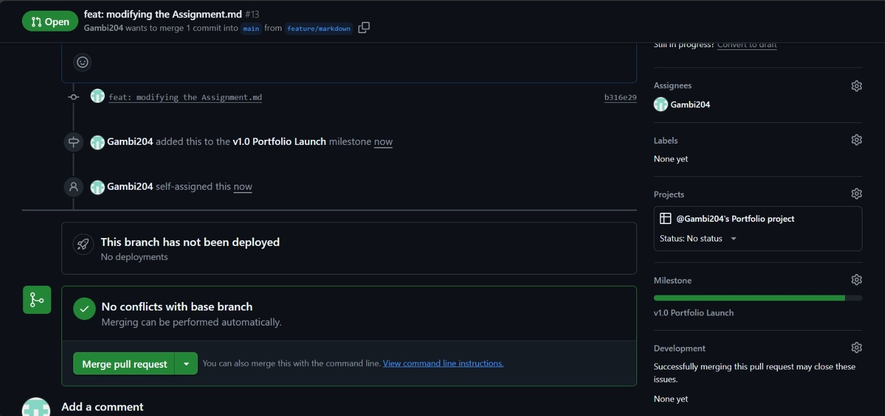

# Personal Portfolio Documentation

## 1. Student Details

- **Full Name**: Emmanuel Mugambi Riungu
- **GitHub Username**: Gambi204
- **Email**: emmanuel.riungu@strathmore.edu

## 2. Deployed Portfolio Link

- **GitHub Pages URL**:  
  _([link to the Github pages](https://is-project-4th-year.github.io/build-your-portfolio-github-workflow-essentials-Gambi204/))_

## 3. Learnings from the Git Crash Program

- **Branching**: Helped me separate different sections for better version control.
- **Pull Requests**: Made it easy to review and merge new changes safely.
- **Issue Tracking**: Helped me organize tasks and track progress efficiently.
- **Milestones**: Gave me a visual progress indicator and deadline for planning work.

## 4. Screenshots of Key GitHub Features

### A. Milestones and Issues

#### Screenshot of Milestone with Closed Issues

#### Screenshot of Milestone with Open Issues

#### Screenshot of Milestone V1.0 Portfolio launch complete to 100%

### B. Project Board

#### Screenshot of the project board

### C. Branching

#### Screenshot of the branches list

### D. Pull Requests

#### Screenshot of the pull-requests

### E. Merge Conflict Resolution

#### Screenshot of merging

